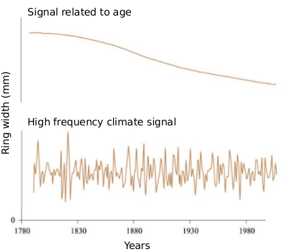

```{r setup, include=FALSE}
knitr::opts_chunk$set(echo = TRUE)
```

# Abstract

Conifer breeding programs are more and more considering wood quality as selection criteria to improve end-use properties. Wood density is among the key traits as it is related to mechanical strength and dimensional stability. Variation of density within a piece of wood may lead to deformation during transformation and inhomogeneous machining properties. In the present study, we aim at disentangling age, genetic and environmental influences on the pith-to-bark variation of wood density. 
We analyzed the wood density profiles of a 16-year-old genetic experimentation plantation from white spruce seedlings grown in nurseries and planted at two years of age. repeated in two contrasting environments (Asselin and Saint-Casimir) in the province of Quebec. A total of 2365 trees belonging to 93 full-sib families were sampled for this study. We developed a model to describe the interannual variation of the wood density from  pith-to-bark. Then, we developed a variability index from the model residues to determine the variation in the density of pith-to-bark in order to identify tree families that are least sensitive to variations in climatic conditions. The genetic control of density, ring width,  model parameters and uniformity index was evaluated. This makes it possible to see the trait the level of heritability of each of these characters and thus to know if it is useful to select trees from orbservations made on these trees. ASReml3 package in R was used to estimate trait genetic parameters based on the residual maximum likelihood. Strong heritability has been observed in density, ring width and model parameters have heritability ranging from low to moderate, and the index of variability has almost no heritability. Future work can be done on older trees and also on one-time events to see if this changes the heritability of the variability index.\

\clearpage

# Introduction

Thousands hectares of Canadian forest are harvested each year and an additional loss is due to insects, diseases and fires [@DRF2000; @NaturalResourcesCanada2019]. In order to avoid deforestation, natural and artificial (planting or seeding) regeneration are used in Canada to compensate for harvests and forest losses. Artificial regeneration is used on more than half of the forests harvested in Canada [@RNC]. One of the reasons for artificial regeneration is for better control of planted trees to meet the demands and requirements of forest industry. Indeed, artificial regeneration, could ideally be made by using better trees than the former ones, i.e. trees that growth faster, that are more resistant to perturbation and that are of better structural quality. Thus, genetic selection is one of the tools for artificial regeneration and is becoming a crucial and increasingly necessary part of the development of canadian forest [@Bonfils2004]. When used in forestry, genetic selection allows to select trees with characters of interest to cross or to reproduce them in order to obtain trees with desired properties for an improved development of the forests or an improved quality of the wood for human use [@zobel1984; @DRF2000; @nanson2004]. \ 

During the first half of the 20^th^ century, most studies about genetic selection were dedicated on increasing wood volume production [@Dhir1976; @nienstaedt1985; @Li1997; @Koubaa2000] but with the increasing demand of high structural quality products and the fear of losing resource from natural causes, the aspects of wood quality became as important as wood volume [@Franceschini2012]. Hence, conifer breeding programs are more and more considering wood quality as selection criteria to improve end-use properties of commercial species such as white spruce. For example, improvement programs by genetic selection are in place for white spruce (*Picea glauca* [Moench] Voss) [@DRF2000; @Mullin2011] which has a significant economic value because of its geographical distribution and abundance [@Eyre1980; @Abrahamson2015] in North America. In Quebec, several generations of seed orchards have already been established in white spruce. Thus, the current objectives of genetic selection for this species are to select trees with a higher wood quality because white spruce has already reached a level considered interesting for traits such as rapid growth and volume of wood. \ 

@mitchell1961 defined the quality of the wood as follows: "Wood quality is the resultant of physical and chemical characteristics possessed by a tree or a part of a tree that enable it to meet the property requirements for different end products". We can consider that it is composed  of two components: one is biological and one economical. Biologically, resistance to mortality by vigor is important to ensure the survival of the tree and the value of the forest. Economically, the quality of the wood for end-use is important for industries as it impact the value of the end products. Several traits were considered to assess the different component of wood quality and the density is one of the most widely used indicators and arguably the most important one [@zobel1989; @Saranpaa1994; @Mckendry2002; @Macdonald2002; @Alteyrac2006]. More specifically the low interannual variability of wood density and rings width has an high importance for stem vigor and wood quality. First of all, it is important to understand that, the interannual variation of wood density comes from two sources: the low-frequency radial profile and the high-frequency radial profile [@Nicault2010]. The low-frequency radial profile is the radial variation of the density of pith-to-bark with a high density during the first years of tree growth  decreases to a certain level and begins to increase again. In white spruce, this radial profile is the radial type II profile described by @panshin1980. These variations are under genetic control and are consequently moderately to highly heritable [@Corriveau1991; @Yanchuk1993; @Ivkovich2002a; @Ivkovich2002b; @Beaulieu2006] because this functioning is internal to the tree and is transmitted to future generations. The high-frequency radial profile is the amplitude of the interannual variation of wood density i.e. the density difference between two consecutive growing years (fig 1). 

{width=200px; height=300px}

This high frequency signal is related to climatic conditions [@Nicault2010]. Therefore, significant inter-annual fluctuations in climate lead to an increase in inter-annual variation in wood density. In the coming years, the range of year-to-year variation in wood density may change due to climate changes. Indeed, wood density is correlated with the growth of the tree [@corriveau1991] and it has been observed that trees with a low variation in growth and therefore in density are also the most resistant to mortality [@ogle2000; @suarez2004; @hartmann2008]. For example, @suarez2004 found that at the tree scale, individuals with variable growth were more prone to die of drought than more regularly growing trees. These studies have shown that the steady growth and therefore the low interannual variation wood density allows the tree to be more vigorous and therefore less prone to related mortality and environmental conditions. With regard to the economical context, interannual variation of density within a piece of wood may lead to deformation during transformation and inhomogeneous machining properties. Indeed, low interannual variability of wood density affects the performance of saw timber, the pulp yield and calorific values for biomass applications for bioenergy [@Hernandez2001; @Macdonald2002; @Mckendry2002]. For example, the low interannual variation in wood density is appreciated for sawnwood because sawyers place a high value on the low interannual variation wood density [Hassegawa et al (pending approval); @X]. It is therefore important from both a biological and an end-use points of view to have a wood with a low interannual density variation within the stem. Therefore, we understand that there might be a strong gain at selecting trees that are prone to produce wood with a low interannual variability of wood density to get a resistant and highly valuable forest in the next decades. For example, future genetic selections in breeding programs for different species of spruce trees in Quebec will consider wood properties such as wood density [@Beaulieu2009; @Mullin2011]. For white spruce wood quality, one of the characteristics that one wishes to select is the amplitude of the interannual variation of wood density, provided that it has sufficiently interesting heritability for a genetic selection. \ 

Heritability is the probability that a trait of an individual is hereditarily transmitted by genes. It is a statistical information that serves to evaluate the part of genome and that of environmental conditions in the construction of the phenotype of a given population. Moreover, several studies have been focused on the understanding the genetic sources of phenotypic variations of wood quality traits (eg. density) and their heritability [@Corriveau1971; @Li1993; @Hernandez2001; @Beaulieu2003; @Lenz2013; @McLean2016]. Previous studies have shown that wood density is a trait under strong genetic control and therefore have a strong heritability [@Corriveau1991; @Yanchuk1993; @Ivkovich2002a; @Ivkovich2002b; @Beaulieu2006]. As mentioned above, the low-frequency radial variation is age-related and under genetic control with strong heritability [@Corriveau1971; @Li1993; @Hernandez2001; @Beaulieu2003; @Lenz2013; @McLean2016]. However, we did not find any studies on heritability of amplitude of interannual variation of wood density in white spruce.\ 

Studies have linked annual environmental conditions such as soil water availability, climatic conditions and interannual variability wood density (high frequency signal) [@becker1995; @huang2007; @Nicault2010; @zaehle2014]. Indeed, long-term growth analyzes have shown a link between wood density and local annual conditions such as summer temperature in white spruce [@darrigo1992] and other species [@becker1995; @huang2007; @zaehle2014]. However, the results of several studies suggest a genetic control of density sensitivity to environmental conditions. For example, studies have suggested a possible link between low sensitivity to drought and genotype [@ferrell1966; @teskey1987]. These studies show that although the interannual variation in density (high frequency signal) is under environmental control, its amplitude may be controlled by a genotype-environment interaction. Therefore, a question arises as to whether the amplitude of interannual variation is primarily under genetic control (heritability) or environmental. Knowing that the interannual variation in density is controlled by the annual environmental conditions, in the context of climatic changes that are likely to increase the interannual variation of environmental conditions, it is crucial to know whether the amplitude of variation in wood density is under genetic control. \ 

In this study, we evaluated the amplitude of the interannual variation (high frequency signal) of wood density in white spruce and its share of heritability in the interannual conditions of the environment. We therefore compare two growth sites containing genotyped trees in order to characterize the genetic (heritability) and environmental contribution to the amplitude of the interannual variation of wood density. Thus, we hope to select and reproduce white spruce trees families of interest that are both low-sensitivity to climates changes and genetically prone to make low amplitude of interannual variation of wood density. If the range of variation in wood density is under genetic control, tree families with the smallest variation ranges can be identified for reforestation.


# Material and method


## Sampling

The material used was sampled from an experimental provenance-progeny test plantations designed to assess the genetic merit of first generation selections, which had been subdivided into breeding groups and delineated by provenance or geographic region. The details of the setting up of the experiment are described in @beaulieu1996. Crosses were made according to a partial diallel mating design within each of the six different breeding groups or sublines [@Burdon1983], which were designed to limit future inbreeding to within group. Each parent tree was used in crossings one to three times, giving half-brother families (trees with one of two parents in common) and full-brother families (trees with both parents in common) in breeding groups. Genetic testing were set up in 1999 on 2-year-old seedlings from these experimental plantations near Asselin balsam fir-yellow birch ecological domain, and Saint-Casimir located in the maple–basswood ecological domain, Quebec, Canada, in randomized complete blocks to avoid any possible impact of heterogeneity within each site (table 1). Trees were assigned to plots in rows of five trees / plot (spacing of 2 m × 2 m) [@beaulieu2014]. In this study, we were used 93 full-brother families for a total of 2365 white spruce trees. The sampled trees were drawn from 18 plots over the two sites and 9–14 individuals were sampled per full-sib cross. Trees used in this study are exclusively full-brother families.\ 

|Site          |Location    | LAT (°N)| LON (°W)| ELV (m)| MAT (°C)| TAP (mm)|Soil type        |Ecological region      |
|:-------------|-----------:|--------:|--------:|-------:|--------:|--------:|----------------:|:----------------------|
|Asselin       |Squatec     |47.88    |-68.44   |349     |2.4      |1042.0   |loamy soils      |balsam fir-yellow birch|
|Saint-Casimir |Saint-Alban |46.70    |-72.11   |53      |4.7      |1135.7   |sandy-loam soils |maple–basswood         |
Table: Location and climatic conditions (over 1981–2010) of the two plantation sites. LAT, latitude; LON, longitude; ELV, elevation; MAT, mean annual temperature; TAP, total annual precipitation.


## Sample preparation and scanning

Wood density and rings width was measured from wood core taken from the sampled trees. Wood cores were extracted to a thickness of 1,68 mm from the south facing side of each tree 15-year-old trees in 2015 with a breast-height diameter (DBH15, 1.3 m above ground). Wood cores were extracted using increment borer which is a specialized tool for extracting wood cores from a living tree with relatively minor damage to the plant itself. These cores were used to determine ring width and wood density. Density was determined by scanning incremental cores from pith-to-bark along the radial face at a resolution of 25 $\mu$m in the QTRS-01X ring analyzer (Quintek Measurement Systems Inc., Knoxville, TN, USA). A weighted mean density line was obtained by summing the product between the annual density measurements and the ratio of the respective radial areas to the total radial area. Wood cores were conditioned to about 7% moisture before scanning. Determination of the wood density makes it possible to calculate a quality index of it. From the density profiles, the limits of the annual growth rings were determined together with the relative proportions of earlywood and latewood in each annual ring. Ring width determined through information of densitometry profiles. The transition between earlywood and the latewood is determined using a script developed, to check for possible errors (missing rings, abnormally low or high readings) and calculate the transition point between the initial wood and the final wood. The script uses the average between the minimum density and the maximum density to obtain the transition density threshold ($D_t$).

<!--- $$D_t= \frac{(D_{min}+D_{max})}{2}$$
Where $D_t$ is ring density threshold, $D_{min}$ is ring minimum density and $D_{max}$ is ring maximum density. Latewood started when this condition is met:

$$D_i < D_t \&\& D_{i+1} >= D_t \&\& D_{i+2} >= D_t$$

Where $D_i$ is the ith density data. ---->  


{width=300px; height=400px}

As part of this study, it is essential to accurately identify the year of formation of the annual rings measured. To this end, we used the technique of Crossdating which consists in obtaining the concordance of the number of rings and of their width pattern to avoid counting errors or those caused by missing rings or by false annual rings. Crossdating  is one of the most important basic principles of dendrochronology. This technique ensures that each tree ring is assigned to the exact year of its formation. This is accomplished by matching patterns of wide and narrow rings between cores from the same tree, and between trees from different positions.
To verify the accuracy of dates and determine if there were missing rings, we used COFECHA, which is a dendrochronology software program used for crossdating and quality control of annual ring measurements [@HOLMES1983]. Annual ring separation was carried out by an algorithm, we eliminated the samples (127 samples) whose dating was not correct and could not be corrected. Any incomplete or false rings were excluded from the dataset.

## Model Development
A model was developed to describe the patterns of variation in mean annual ring density in the stem in white spruce for the purpose of modeling the known density variation portion and subtracting it to better observe the rest of the density variations. Latewood density in white spruce is more sensitive to annual variations in climate than the width of the ring [@darrigo1992]. So we applied our model to density and percentage of latewood in order to better evaluate the amplitude of interannual variations in density.\
Our data has a hierarchical structure, with observations on annual rings nested in the cores, cores nested in the trees, and trees nested in blocks. Unlike some previous studies [@franceschini2010; @gardiner2011] that used mixed models to describe the radial density profile, we adjusted the curve of our equation to each core for a better description of the profiles. We, therefore, used the optim function of the stats package in the R [@R2018] statistical programming environment to find the best parameters iteratively for each tree core. 
As in the study of @Xiang2014, pith-to-bark wood density profiles in our data were different among cores. A nonlinear equation was fit for each core to describe ring density profiles, producing different parameter estimates for each core. The radial pattern of wood density in white spruce can be described as follows: 

$$RD(t) = b_0 \times \exp\left(\frac{b_1}{t}\right) + \frac{t}{b_2} + e $$

where RD is the mean ring density (kg.m^-3^), t is cambial age (years), $b_0$, $b_1$ and $b_2$ are adjusted parameters, and $e$ is the residual error term. Parameter $b_0$ denotes the intercept when t approaches a theoretical value of 0; $b_1$ denotes the scale parameter of the early decrease in RD. $b_2$ denotes the rise in RD at the end of the juvenile wood and at the beginning of the mature wood formation. The error term $e$ was assumed to be normally distributed, with N (0, $\sigma^{2}$). The first exponential term $b_0 \times \exp\left(\frac{b_1}{CA}\right)$ has a value which decreases rapidly in the first few annual rings and then gradually approaches an asymptote close to zero. The graph in figure 2 describes the three parameters of our model and allows us to understand how each parameter influences our model (Fig 2).


It can be observed in figure 2 that the parameters $b_0$ and $b_1$ influence the whole of the curve. An increase of one of these parameters leads to that of the density on all the ring. Unlike parameter $b_0$ and $b_1$, parameter $b_2$ seems to be influenced by some of the density. A low value of this parameter causes a sharp increase of the density starting from the third growth year and when this parameter increases a decrease of the density is observed at this level until the curve is similar to the cases of the parameters $b_0$ and $b_1$. \ 

This modeling of the density profiles then made it possible to subtract the estimated profile which represents the low frequency signal share described previously in the introduction. Thus, only the part of the high-frequency signal that interests us remains to evaluate the variability of the density related to factors external to the tree.\ 

## Determination of interannual radial variation amplitude of wood density index
Type II variation profile (low frequency signal) being subtracted from the residues represents the high frequency signal which is the interannual variation. In order to identify tree families with low interannual variation amplitude in density, we have created a index. This index makes it possible to determine the amplitude of the interannual variation of the density in order to identify the families of trees least sensitive to the variations of the environmental conditions. We subtracted the density residues values of year $n-1$ from year $n$. We were interested more specifically in the difference between the average density residues of annual rings of two consecutive years, no matter whether the difference was positive or negative. The absolute value was used for each difference to get rid of the sign. The index was estimated from the following formula:

$$V = \sum | D_n - D_{n - 1} |$$

Where V is the index, $D_n$ is the wood density residues of year $n$ and  $D_{n - 1}$ is the wood density residues of year $n-1$. 
V was determined for wood density over ring the width, density and percentage of latewood. Evaluation of this index for both ring width and latewood will compare the effects of the annual climate that influence the latewood and those associated with the spring conditions that influence ring density [@darrigo1992].

## Spearman’s rank correlation coefficient (Spearman’s rho) 
We used a Spearman’s rank correlation coefficient to make a comparison of the response of the tree families between the two study sites. This comparison will allow determine the interaction between the environment and the family effect. The elements for which we calculated Spearman’s rho are: V for each of the tree families between two study sites and the three parameters to estimate from the model. The $cor.test$ function in the R [@R2018] statistical programming environment was used to calculate Spearman’s rho. We used a 95 percent confidence interval.

<!---$$rho = \frac{cov(rg_X,rg_Y)}{\sigma_{rg_X} \times\sigma_{rg_Y}}$$
Where $rho$ is a nonparametric measure of rank correlation, $cov(rg_X,rg_Y)$ is the covariance of the rank variables. $\sigma_{rg_X}$ and $\sigma_{rg_Y}$ are the standard deviations of the rank variables. ----->

## Quantitative genetic analyses
Analyses of variance and covariance for various wood density and tree growth traits studied were performed to estimate genetic parameters. Variance components for genetic analysis were estimated using ASReml 3 [@Butler2018] based on linear mixed-effects model using as follows:

$$ Y_{ijkl} = \mu + s_i + b_{(i)j} + f_k + bf_{(i)jk} + e_{ijkl}$$

where $Y_{ijkl}$  is the observation on the $ijklth$ tree, $\mu$ is the overall mean, $s_i$ is the fixed site effect, $b_{(i)j}$ is the fixed effect of the $j^{th}$ bloc in site $i$, $f_k$ is the random effect of the $k^{th}$ family, $bf_{(i)j}$ is the random interaction of family and bloc, and $e_{ijkl}$ is the residual effect.
The genetic control of these wood density components, weighted in each ring by their respective sectional area, was evaluated by estimating individual-tree heritability (h^2^).  
In a full-sib design with random mating, members of the same family are presumed to share half of their genes [@white2007]. Therefore, Individual-tree narrow-sense heritability ($hi^2$), obtained based on each fitted regression function, was calculated using the following equation:
 
 $$hi^2= 2 \frac{\sigma^2_f}{\sigma^2_t}$$
 
Where $hi^2$ is individual heritability, $\sigma^2_f$ is family variance, $\sigma^2_t$ is total variance. \ 


# 3 Results

## Mean density per ring and model prediction
Wood density variation from the pith-to-bark is similar in the two study sites between the first and the fifth year (Fig. 4). The pattern observed at the two sites corresponds to type II pith-to-bark profile described in introduction. When considering all the cores of trees from the pith-to-bark, ring density decreased rapidly from 430 kg/m^3^ to 370 kg/m^3^ for Saint-Casimir and from 455 kg/m^3^ to 375 kg/m^3^ for Asselin site in the first 5 growth rings. From the sixth year, we observe a stabilization of the density at 375 kg/m^3^ of the site of Asselin (Fig. 4A) unlike the site of Saint-Casimir (Fig. 4B) where we observe a increase  to reach a plateau at the eigth year (380 kg/m^3^). \ 

Like ring density, the latewood density has a type II pith-to-bark profile for two sites (Fig. 4C: Asselin, Fig. 4D: Saint-Casimir). Latewood density decreased rapidly from 500 kg/m^3^ to 480 kg/m^3^ for Saint-Casimir and from 510 kg/m^3^ to 450 kg/m^3^ for Asselin site in the first 5 growth rings. From the sixth year, we observe a stabilization of the density at 450 kg/m^3^ of the site of Asselin (Fig. 4C) unlike the site of Saint-Casimir (Fig. 4D) where we observe a increase  to reach a plateau at the eigth year (4900 kg/m^3^). \ 

As for the percentage of latewood, the trend has a type II pith-to-bark profile for two sites  (Fig. 4E: Asselin, Fig. 4F: Saint-Casimir). In Asselin, the percentage of latewood decreases between 28% in the first year and 15% in the fourth year, then increases to 17% before decreasing again to 12.5%. In Saint-Casimir, latewood decreases between 25% in the first year and 12.5% in the fourth year, then increases to 15% before decreasing again to 13%.\ 


{height=80%}

|Sites             |N    |$R^2$ Adjusted|       E|  E    |  E%|
|:-----------------|----:|-------------:|-------:|------:|---:|
|Asselin           | 1035|0.49          |0.000008|58.6   |0.15|
|Saint-Casimir     | 1162|0.49          |0.00007 |48.1   |0.13|

Table: Fit indices and error statistics for the fitted model. Mean error (E), mean absolute error (|E|), and mean absolute percentage error (E%) were calculated from the fixed part of each model.


The fit of the model we developed allowed us to take into account the density profile of each individual tree. A summary of the parameter values obtained of the model fitting process (Eq. 1) can be found in table 3. The parameters of the model are similar between the two sites, the standard deviations of the mean of these intersect (Table 3). Non-significance of the difference that exists between the parameters is observed at the level of those of the ring density , those of the latewood density and those of the percentage of latewood. The percent change in density explained by cambial age is 49% in the model for each of our two sites (Equation 1) (Table 2). The mean error, the mean absolute error, and the mean percent error were 8^-6^ $kg.m^-3$, 58.6 $kg.m^-3$ and 15%, respectively, for the Asselin site and 7^-5^ $kg.m^-3$, 48.1 $kg.m^-3$ and 13% for the Saint-Casimir site (Table 2). There were no obvious trends in plots of the normalized residuals versus fitted and explanatory variables for Equation 1 (results not shown). The fit of the model is therefore similar at both sites (49%).  \  

|Parameters          |Asselin|Saint-Casimir|
|:------------------:|------:|------:|
| $b_0$              |302.78 $\pm$ 55.90|304.40 $\pm$ 41.90|
| $b_1$              |0.97 $\pm$  0.16 |1.09 $\pm$ 0.15 |
| $b_2$              |17.02 $\pm$ 2.20 |14.87 $\pm$  2.00 |
| $b_0$_lw_density   |568.02 $\pm$ 70.30|443.30 $\pm$ 53.00|
| $b_1$_lw_density   |-0.04 $\pm$ 0.19 |0.10 $\pm$ 0.10 |
| $b_2$_lw_density   |-299.10 $\pm$ 30.31|-268.40 $\pm$ 200.0|
| $b_0$_lw_percentage|68.82 $\pm$ 30.3 |85.80 $\pm$ 30.80|
| $b_1$_lw_percentage|-104.60 $\pm$ 33.04|-133.40 $\pm$ 21.80|
| $b_2$_lw_percentage|79.69 $\pm$ 20.77|18.30 $\pm$ 2.46 |
Table: Comparison of each parameter average ($b_0$, $b_1$ and $b_2$) of equation 1 between the two study sites. Parameter $b_0$ denotes the intercept when t approaches a theoretical value of 0. Parameter $b_1$ denotes the scale parameter of the early decrease in ring density. Parameter $b_2$ denotes the rise in ring density at the end of the juvenile wood and at the beginning of the mature wood formation. $b_0$_lw_density is $b_0$ of latewood density, $b_1$_lw_density is $b_1$ of latewood density, $b_2$_lw_density is $b_2$ of latewood density, $b_0$_lw_percentage is $b_0$ of latewood percentage, $b_1$_lw_percentage is $b_1$ of latewood percentage and $b_2$_lw_percentage is $b_0$ of latewood percentage.


## Interannual variation in density and index V
Interannual variation of the density can be observed in Figure 5. It has an amplitude that varies from one tree to another. This amplitude was measured from our index V. The average value of the index V (Asselin: 417.5 $kg.m^-3$, Saint-Casimir: 339.8 $kg.m^-3$) is represented in figure 5A. This result shows that the index V is not significantly (standard deviation) different between the two study sites. Trees therefore behave similarly between sites with regard to the V index. Thus this index allows a classification of the trees in order from the amplitude of interannual variation of density of the wood. The trees with the lowest V index are those with low interannual variation. The average value of the index V (Asselin: 293.7 $kg.m^-3$, Saint-Casimir: 292.1 $kg.m^-3$) determined from latewood is shown in Figure 5B. The average value of the index V (Asselin: 53.5 $kg.m^-3$, Saint-Casimir: 41.9 $kg.m^-3$) determined from latewood percentage is shown in Figure 5C. \ 

{width=85%, height=90%}  

\clearpage

## Family-tree interaction and individual heritability.
The results of the rank correlation coefficient are summarized in figure 6. These results show an absence of correlation for the index V (p > 0.05), a significant correlation for ring density (p < 10^-5^), a significant correlation for latewood density (p < 10^-5^), a significant correlation for latewood percentage (p < 10^-5^), a significant correlation for latewood index V (p < 10^-5^), a significant correlation for latewood percentage index V (p < 10^-5^), a significant correlation for all the parameters of the model (p < 10^-5^). The value of R is very similar between the parameters. There is a significant correlation for traits related variation in density from pith-to-bark and for latewood index V. On the other hand, there is no correlation when considering the interannual variation of the density.  


![Spearman rank correlation coefficients and their significativity between the two study sites (Asselin and Saint-Casimir) of the density, index of the amplitude of interannual variation of the density (V), index of the amplitude of interannual variation of latewood density (Vlwd), $b_0$ of latewood density ($b_0$.lw.d), $b_1$ of latewood density ($b_1$.lw.d), $b_2$ of latewood density ($b_2$.lw.d), $b_0$ of latewood percentage ($b_0$.lw.p), $b_1$ of latewood percentage ($b_1$.lw.p), $b_2$ of latewood percentage ($b_2$.lw.p) and parameters of the equation 1. Significance levels are indicated by ***: P<0.0001; NS:no significant.](graph_table/Spearman_rank_correlation.pdf) 

Individual inheritance of: Ring density, ring width , index of the interannual variation of density (V), parameters ($b_0$, $b_1$ and $b_2$) of equation 1, latewood density (lw.d), index interannual variation in latewood density (V.lw), $b_0$ of latewood density ($b_0$.lw), $b_1$ of latewood density ($b_1$.lw), $b_2$ of latewood density ($b_2$.lw), ring index interannual variation in latewood percentage (V.lp), latewood percent per ring (lp), $b_0$ of latewood percentage ($b_0$.lp), $b_1$ of latewood percentage ($b_1$.lp) and $b_2$ of latewood percentage ($b_2$.lp) for each of our two study sites is shown in Figure 7. This graph presents estimates of individual heritability for the individual tree level. Analysis of heritability showed no significant differences among sites for all traits. At first, when we consider the ring in its entirety, heritability varies between 6.10^-6^ and 0.58 (Asselin) and between 3.10^-6^ and 0.71 (Saint-Casimir) depending on the traits studied. Individual heritability is not significantly different from one to the other. On the other hand, it is significantly different between the traits that are related to the variation of the density of pith-to-bark and that of the amplitude of interannual variation. except index V of latewood percentage, all the parameters have a lower heritability for latewood percentage than for the density of latewood or the entire ring. \  

![Individual inheritance of: Ring density, index of the interannual variation of density (V), parameters ($b_0$, $b_1$ and $b_2$) of equation 1, latewood density (lw.d), index interannual variation in latewood density (V.lw), $b_0$ of latewood density ($b_0$.lw), $b_1$ of latewood density ($b_1$.lw), $b_2$ of latewood density ($b_2$.lw), ring index interannual variation in latewood percentage (V.lp),latewood percent per ring (lp), $b_0$ of latewood percentage ($b_0$.lp), $b_1$ of latewood percentage ($b_1$.lp) and $b_2$ of latewood percentage ($b_2$.lp) for each of our two study sites. Standard errors of genetic correlations are given by error bars.](graph_table/heritability2.pdf) 

\clearpage

# 4 Discussion

Our data showed a typical radial pattern of wood density already observed in spruce trees in other researchers [@Alteyrac2006; @GARDINER2011; @Xiang2014] with the density initially decreasing outwards from the pith before slowly increasing towards an asymptotic value. This pattern corresponds to the type II pith-to-bark profile described by @panshin1980. The high density of wood adjacent to the pith has been attributed to high earlywood density and low latewood proportion [@alteyrac2007; @koubaa2007]. Indeed, the high density of earlywood in the first years of growth is explained by the fact that in the first years of a tree's life, it produces "flexure wood" that is high density [@telewski1989]. This type of wood is formed because the low rigidity of the young trees that allows them to withstand environmental constraints without breaking. The proportion of this wood decreases rapidly in the first few rings. The increase in density that follows the decline of the latter is related to the proportion of latewood that increase in mature wood [@clark2007]. Similar hypotheses have been proposed to explain radial variation in wood properties by @Lachenbruch2011. However, this radial pattern does not take into account the interannual variability of density. \  

The modeling of individual profiles is suitable for the description of the wood density of our type II data. The choice of an equation containing two separate components allowed enough flexibility to represent the large variation in density profiles. The first term in the equation is capable of describing the type II density pattern previously described, whilst the second term was included when it was necessary to model a density increase close to the bark. The prediction of the model on all data that can be seen in Figures 3 and 4 is an example of the modeling that is done for individual profiles. The relatively poor fit of the full model in this study could be explained by the fact that, despite its classification as a type II species, wood density profiles in white spruce are, in reality, extremely variable. The choice of modeling the variation of the density of each of the trees made it possible to adapt the model to the variations between the trees. The fact that the model equation is composed of two components has given sufficient flexibility to properly describe type II density. This type of equation has been used previously in the study of @Xiang2014, where the authors used a three-component equation. In their case, the third component was used to describe a decline near the bark, which is not the case with what is observed in our study.\ 

Although the density variation to a similar profile, it remains slightly different between the two sites. This difference can be explained by the difference in pedoclimatic conditions between sites. In fact, the soil type is different between sites and the climate is colder in Asselin which is further south compared to Saint-Casimir. In addition, the young age (15 years) of our trees could have an impact on the difference in density profiles between study sites, because it was observed that in white spruce, the environmental control being higher than the genetic control the first years of life of the tree [@Corriveau1991], the conditions of the site thus played an important role. Indeed, the observation of the parameter $b_2$ of model equation allows to see that the rise of the density profile is related to the second term of the equation, and a great value of age cambial causes a greater rise of the profile of density. It can be hypothesised that the effect of the site on density profiles would have been smaller in an older stand. This result is in accordance with observations in white spruce [@Corriveau1991] and black spruce [@Xiang2014]. At the level of the model parameters, the sites are also different and this difference explained by the profiles of density that are not the same.\ 

Like the density profiles, index V is different between the two sites, despite the fact that they are the same families of trees. Since the index V is calculated from the model residuals, the difference can be explained by the fact that the variability that is related to the internal control of the trees has been subtracted from the model and that the remaining one is more controlled by external phenomena related to the study sites. Index V being more under environmental control than genetic, this explain the lack of heritability of this index. The model has made it possible to subtract the type II pith-to-bark profile of the density variation which is related to the internal functioning of the tree [@Lachenbruch2011] and thus under genetic control. Once the portion of the variation under genetic control is subtracted, the rest of the variability can only be of a pedoclimatic order.\ 

Index V being different between the sites, as one would expect Spearman's rank coefficient of correlation is not significant (p-value = 0.43; rho = 0.08) for this index. This coefficient value is in agreement with the previous results which show a difference between the two sites and the fact that the index V is likely under environmental control. The similarity of the correlation coefficient between the three parameters is explained by the fact that the model adapts well to each of the two sites. Spearman's Rank Correlation Coefficient highlights the interaction between family and environment. The interaction is more or less important from one factor to another probably because some factors are more controlled by the environment and others by genetics.\ 

Genetic parameter estimates were used to evaluate the variation of density as a selection trait for wood quality. With regard to heritability of density, it is high at both sites. This strong density heritability is similar to previous studies in white spruce [Nelson 1963 in @mothe1983; @Corriveau1991; @Yanchuk1993; @Ivkovich2002a; @Ivkovich2002b; @Beaulieu2006]. All of these studies reported values between 0.36 and 0.80. Average density of our data is therefore highly controlled by genetics as might be expected.
In contrast to density, annual ring width has low to moderate heritability in each site and also for combined sites. This result, which is in agreement with previous studies [@Corriveau1991; @Ivkovich2002a], is explained by the difference we observe when we take the sites separately and when they are combined can be explained by a genotype-environment interaction [@kremer1986], this happens when conditions from one environment to another do not have the same effect on the genotype. This result suggests that, if trees are to be selected for reforestation as a result of this study, the territory be divided into relatively homogeneous subunits, within which the recommended sources will be able to keep their superiority and can be used without risk of maladjustment [@beaulieu1989stabilite].
The parameters of the model, as for them, they have a low heritability either for each site separately or for the combined sites. The parameter $b_0$, has a higher heritability than the other parameters but remains low. This can be explained by the fact that this parameter is very little influenced by cambial age because it is described the density close to pith. In fact, $b_0$ is the ordinate at the origin and thus little influenced by the sites (environmental conditions). Since parameters $b_1$ and $b_2$ are the parameters that describe the change in density over the years of tree growth, they are more likely to be influenced by environmental conditions.
The index V has a heritability close to zero for each of the sites (Asselin 6.10^-6^ and Saint-Casimir 3.10^-6^) and the two sites combined (1.10^-7^). The low genetic control of the index V shows that in addition to the fact that the interannual density variability is controlled by environment [@becker1995; @huang2007; @Nicault2010; @zaehle2014], its amplitude is also controlled by environment. One hypothesis that can explain the low heritability of the V index is the young age of our trees. Indeed, the study of @Gaspar2008 showed an increase in the heritability of the components of density with age. As a result, we can hope for an increase in the heritability of the index V for much older trees. \ 

Our study can allows identify trees with low variation from pith-to-bark but includes limitations for identifying tree that may have low interannual variation in wood density as part in tree genetic selection. Future studies should focus on the resilience and variability associated with one-time events such as short-term water stress. In addition, the trees used for this study are relatively young, we can be interested in older trees.

# Conclusion

This study assessed the variability of wood density in white spruce. Using the optimal function of the stats package to find the best parameters iteratively for each tree allowed to have an adjustment for the density profile of each of the trees in the study. Thus, the index of variability of the density was determined from the profile of each tree. The low heritability of this index puts a damper on its use for identifying potential tree family of interest for breeding programs from a low interannual variability perspective of wood density. As for the heritability of ring density and width, it is similar to what can be found in previous studies. This study showed that the amplitude of the high frequency signal is variable between trees but that this variation is not controlled genetically. The application of the method used in this study to older trees can be interesting in order to make a comparison and see if the heritability is the same and if this index can be used in this case to select families of trees for genetic improvement.

\clearpage

# References
