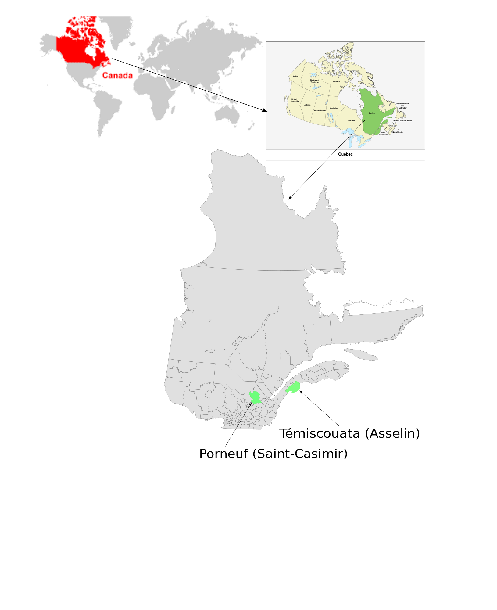

```{r setup, include=FALSE}
knitr::opts_chunk$set(echo = TRUE)
```

# Abstract

Conifer breeding programs are more and more considering wood quality as selection criteria to improve end-use properties. Wood density is among the key traits as it is related to mechanical strength and dimensional stability. Variation of density within a piece of wood may lead to deformation during transformation and inhomogeneous machining properties. In the present study, we aim at disentangling age, genetic and environmental influences on the pith-to-bark variation of wood density. 
We analyzed the wood density profiles of a 16-year-old genetic experimentation plantation from white spruce seedlings grown in nurseries and planted at two years of age. repeated in two contrasting environments (Asselin and Saint-Casimir) in the province of Quebec. A total of 2365 trees belonging to 93 full-sib families were sampled for this study. We developed a model to describe the interannual variation of the wood density from  pith-to-bark. Then, we developed a variability index from the model residues to determine the variation in the density of pith-to-bark in order to identify tree families that are least sensitive to variations in climatic conditions. The genetic control of density, ring width,  model parameters and uniformity index was evaluated. This makes it possible to see the trait the level of heritability of each of these characters and thus to know if it is useful to select trees from orbservations made on these trees. ASReml3 package in R was used to estimate trait genetic parameters based on the residual maximum likelihood. Strong heritability has been observed in density, ring width and model parameters have heritability ranging from low to moderate, and the index of variability has almost no heritability. Future work can be done on older trees and also on one-time events to see if this changes the heritability of the variability index.\

\clearpage

# Introduction

Canadian forest is an important part of the country's history, culture, natural environment and economy. But thousands of hectares of canadian forest are harvested each year and an additionnal loss is due to insects, diseases and fires [@DRF2000; @NaturalResourcesCanada2019]. To maintain ressource constant, it is therefore essential to compensate the sampling and the looses by reforesting. The reforestation, when under human control, could ideally be made by using better trees than the former ones, i.e. trees that growth faster, that are more resistant to perturbation and that are of better stuctural quality. To achieve this task, we must take into account the cambial activity that is governed by environmental conditions and genetics [@Dufour2010; @Rossi2012]. Therefore, genetic selection is one of the available tools and is currently becoming a crucial and increasingly necessary for the development of the canadian forest [@Bonfils2004]. It allows to select trees with characters of interest and to cross them or to reproduce them in order to obtain trees with interesting properties for the development of the forests or the quality of the wood for the human use. \ 
Improvement programs by genetic selection are in place for the most important commercial species [@DRF2000; @Mullin2011] including white spruce (Picea glauca (Moench) Voss) which has a significant economic value because of its geographical distribution and abundance [@Eyre1980; @Abrahamson2015]. Spruce wood is valuable as lumber, material for carpentry products and for pulping because of the characteristics of its fibres [@Zhang2008]. In addition, the plasticity of spruce, enable this species to adapt to various types of soil and climatic conditions [@Nienstaedt1990]. All these characteristics make white spruce a species of great interest in North America and consequently it is heavily reforested in various silvicultural systems in Canada with more than 150 million of natural an hybrid seedlings planted yearly accross almost all forested regions which represents a wide range of soils types and a climatic conditions [@Canadian2009]. \ 

During the first half of the 20th century, most studies about genetic selection were dedicated on increasing wood volume production [@Dhir1976; @nienstaedt1985; @Li1997; @Koubaa2000] but with the increasing demand of high structural quality products and the fear of lossing ressource from natural causes, the aspects of wood quality became as important as wood volume [@Franceschini2012]. Therefore, conifer breeding programs are more and more considering wood quality as selection criteria to improve end-use properties. Wood quality has mainly two components: biologic and economic. The biologic component is the resistance to mortality by vigor and the economic component is the value of the wood for end-use. Several traits were considered for wood quality economic and the density is one of the most widely used indicators and arguably the most important one [@zobel1989; @Saranpaa1994; @Mckendry2002; @Macdonald2002; @Alteyrac2006] because this trait is important for both components of quality and strongly correlated with different mechanical (mechanical resistance and the dimensional stability) and anatomical wood traits [@zobel1989]. Thus, variation in density within a piece of wood may lead to deformation during transformation and inhomogeneous machining properties. Consequently studies have been set up to understand the genetic sources of phenotypic variations of wood quality [@Corriveau1971; @Li1993; @Hernandez2001; @Beaulieu2003; @Lenz2013; @McLean2016]. For example, future genetic selections in breeding programs for different species of spruce trees in Quebec will consider wood properties such as wood density [@Mullin2011; @Beaulieu2009]. 
With regard to the biological component, in has been demonstrated [@Hietz2013; @osazuwa2014] that trees with a more uniform wood densitiy within the stem are also the more resistant to mortality. For example a uniform density gives a greater mechanical resistance to the wind and therefore a lower probability of mortality during a climatic event such as a storm. With regard to the economical context, uniformity affects the performance of saw timber, the pulp yield and calorific values for biomass applications for bioenergy [@Hernandez2001; @Macdonald2002; @Mckendry2002]. For exemple, a strong interannual variation of the density of the wood leads to a decrease of the mechanical resistance while a relatively uniform density produce wood with better mechanical performance. It is therefore important from both a biological point of view and a end-use point of view to have a wood with a uniform density within the stem. \ 

In view of the studies cited aboves, we understand that there might be a strong gain at selecting trees that are prone to produce wood of uniform density to get a resistant and higly valuable forest in the next decades. To reach this goal is important to understant where do the variations of density come from. In white spruce, there is a typical low frequency radial pattern of variation from pith to bark [@Moore2011]. First a decrease of density during the first years of growth and then an increase from the beginning of the formation of mature wood [@panshin1980]. In addition, this radial variations there are hight frequency interannual variation [@Nicault2010]. Contrary to the radial variation that is under internal control, the interannual variation of the density is influenced mainly by events events to the tree such as the edaphic and climatic conditions [@Nicault2010] that happen at high frequency. \ 

Unlike growth that is more controlled by environment than genetic and therefore has low to moderate heritability [@Ivkovich2002a], wood density in white spruce is under strong genetic control with moderate to high heritability [@Corriveau1991; @Yanchuk1993; @Ivkovich2002a; @Ivkovich2002b; @Beaulieu2006] and this makes this trait attractive for genetic improvement. Moreover, Climate is a determining factor for the growth and physiological processes of trees. As a result, climatic conditions strongly affect the properties of wood. In fact, certain climatic factors such as drought can cause stress in trees and cause a variation in wood properties, including density, ring width and conductivity. In addition, long-term growth analyzes have shown that it may increase due to temperature, atmospheric CO2 content and nitrogen deposition [@becker1995; @huang2007; @zaehle2014]. Knowing that density can be negatively correlated with growth in spruce [@zhang1995], it is essential to take climat factor into account.

The timeframe of improved forest management being long [@Zobel1972] it is essential to take into account the current climate change context [@Gray2016]. With the increasing temperature, the trees are expected to growth faster and thus being of lower quality because of lower density [@corriveau1987; @DeBell1994; @Lindstrom1996; @Dutilleul1998; @Bouriaud2005]. It is necessary to anticipate the possible environmental variations because more important frequencies water stress or important precipitations are feared with the climatic changes [@IPCC2007; @pachauri2014]. These environmental variations may lead to an increase or decrease in radial growth and thus cause greater variations in the density of the wood. In addition to selecting trees that are prone to produce wood of uniform density we must also ensure that these properties will persist in time with climatic change. Thus the selection must also considered the stability of the properties in time or, more accuralty, with climate change. furthermore, heritability of density has been proven in several studies, but there is no evidence to suggest that density variability is hereditary. The heritability of this trait could qualify it for the selection criteria for future breeding programs for producing better quality wood.\ 

In this study we quantified and compared heteregoneity of wood density from trees of known parents in order to figure out if some individus produce more uniform wood than others. Knowing the parents of each tree we tried to characterize the genetic contribution to the homogeneity. By comparing two growth sites we tried to characterize the environmental contribution to homogeity. We ultimalty aim to select and reproduce trees families of interest that are both low-sensitivity to climate change and genetically prone to make homogenous wood. Thus, the most homogeneous families will be identified for reforestation and identify variables to consider in breeding of growing trees with less variable wood.


# Material and method


## Sampling
The dataset used in this study came from genetic selection for a series of tests according to provenances [@Beaulieu1996]. The improvement program for this region was led by Quebec’s Ministry of Forests, Wildlife and Parcs, Canada. Experimental plantings were initiated from white spruce seedlings grown in nurseries and planted at two years of age at a regular spacing between trees of 2 m in all directions. This series of tests was established in 1999 by the Canadian Forest Service and is one of the three essential parts of the white spruce breeding program in Quebec. Two sites were selected for sampling: one near Saint-Casimir, Quebec (46.6994, -72.1119), in the maple–basswood ecological zone (warm weather) , and the other one near Cabano (Asselin), Quebec (47.8808, -68.4436), in the balsam fir-yellow birch ecological zone (cool weather) (fig 1). Between 9 and 14 trees per site were sampled from each of the 93 full-sib families, for a total sample of 2365 trees. Tree height and diameter at breast height (DBH, 1.3 m above ground) were recorded in 2015 at the age of 15 years, and a wood increment core was extracted from the south facing side of each tree. Cores were stored in a freezer, conditioned to 7% moisture and cut to 1.68 mm thickness prior to X-ray densitometry analyses (Quintek Measurement Systems, TN). Wood density was calculated as a ring area weighted mean from recorded pith to bark wood density profiles. 

{width=500px; height=500px}

Growth ring density and ring width measurements were taken from pith-to-bark, using an X-ray densitometer (Quintek Measurement Systems, TN) at a resolution of 0.0254 mm, and the data were reported as relative wood density on a dry weight basis. To verify the accuracy of dates and determine if there were missing rings, we used COFECHA, which is a dendrochronology software program used for cross-dating and quality control of annual ring measurements [@HOLMES1983].

## Model Development
A model was developed to describe the patterns of variation in mean annual ring density in the stem in white spruce. 
Considering the hierarchical structure of the data, with annual rings nested in the cores, cores nested in the trees, and trees nested in blocks, we opted for a mixed-effects modelling approach using nlme package [@NLME2018] in the R statistical programming environment [@R2018]. This type of model also considers the autocorrelation between the observations [@Lindstrom1990]. Thus, the estimates of the parameters can vary randomly around the average values of each level of the data structure (site, block, tree, core) [@Auty2013]. As in the study of @Xiang2014, pith-to-bark wood density profiles in our data were different among cores. A nonlinear equation was fit for each core to describe ring density profiles, producing different parameter estimates for each core. The radial pattern of wood density in white spruce can be described as follows: 

$$RD = b_0 \times \exp\left(\frac{b_1}{CA}\right) + \frac{CA}{b_2} + e $$

where RD is the mean ring density (kg.m^-3^), CA is cambial age (years), $b_0$, $b_1$ and $b_2$ are empirically determined parameters, and e is the residual error term. Parameter $b_0$ denotes the intercept when CA approaches a theoretical value of 0. We noticed that it was impossible to optimize the equation using the same estimated parameters for all tree cores, because the pattern of variation of annual rings average density of each tree is more or less different from the others. We, therefore, used the optim function of the stats package in the R [@R2018] statistical programming environment to find the best parameters iteratively for each tree core . The fit of the model was evaluated by visual analysis of the model residual curves against adjusted values and explanatory variables, fit indices (R^2^) [@Pape1999]. The graphic description in figure 2 of the three parameters of our model makes it possible to understand how each parameter influences our model (Fig 2). 


It can be observed in figure 2 that the parameters $b_0$ and $b_1$ influence the whole of the curve. An increase of one of these parameters leads to that of the density on all rings. Unlike parameter $b_0$ and $b_1$, parameter $b_2$ seems to be influenced by some of the density. A low value of this parameter causes a sharp increase of the density starting from the third ring and when this parameter increases a decrease of the density is observed at this level until the curve is similar to the cases of the parameters $b_0$ and $b_1$. Beyond the value 1, the parameter $b_2$ does not influence the variation of the density.\ 

## Determination of the wood density variability index
The variability index is an index to determine the variation in the density of pith-to-bark in order to identify tree families that are least sensitive to variations in climatic conditions. The residues of our model were used to obtain the wood density variability index, which was determined using an equation. We subtracted the density residues values of year $n-1$ from year $n$. We were interested more specifically in the difference between the average density residues of annual rings of two consecutive years, no matter whether the difference was positive or negative. The absolute value was used for each difference to get rid of the sign. The index was estimated from the following formula:


$$V = \sum | D_n - D_{n - 1} |$$

Where V is the variability index, $D_n$ is the wood density residues of year $n$ and  $D_{n - 1}$ is the tree density residues of year $n-1$. 

## Spearman’s rank correlation coefficient (Spearman’s rho) 
To describe the link between two variables by means of a monotonic function, we used Spearman’s rank correlation coefficient. We calculated this coefficient for the index of variability and the different parameters of the model. The elements for which we calculated Spearman’s rho are: the variability index for each of the tree families between two study sites, the model residues for each of the families and the three parameters to estimate from the model. The cor.test function in the R [@R2018] statistical programming environment was used to calculate Spearman’s rho. We used a 95 percent confidence interval.

## Quantitative genetic analyses
Variance and covariance for genetics were estimated using mixed models [@Lenz2013] of the R software. The model used is as follows:

$$ y_{ijkl} = \mu + s_i + b_{(i)j} + f_k + bf_{(i)jk} + e_{ijkl}$$

where $yijkl$  is the observation on the $ijklth$ tree, $\mu$ is the overall mean, $s_i$ is the fixed site effect, $b_{(i)j}$ is the fixed effect of the $j^{th}$ bloc in site $i$, $f_k$ is the random effect of the $k^{th}$ family, $bf_{(i)j}$ is the random interaction of family and bloc, and $e_{ijkl}$ is the residual error.
In a full-sib design with random mating, members of the same family are presumed to share half of their genes [@white2007]. Therefore, individual heritability was obtained as follows:
 
 $$h_2= 2 \frac{V_f}{V_T}$$
 
Where $h_2$ is individual heritability, $V_f$ is family variance, $V_T$ is total variance.
ASReml3 package [@Butler2018] in the R statistical programming environment [@R2018] was used to estimate trait genetic parameters based on the residual maximum likelihood.

#3 Results

The model we have developed has made it possible to optimize the density of the wood for each study site. In table 1, we observe that the average value of the parameters differs between Asselin and Saint-Casimir. for the parameters b0 and b1, the average is higher in Saint-Casimir and for parameter b2 it is higher in Asselin.\ 

|Site                     |Parameter |    Min|   Mean|    Max|
|:------------------------|:---------|------:|------:|------:|
| Asselin (Témiscouata)   |$b_0$     | 257.26| 302.78| 369.78|
|                         |$b_1$     |  -0.93|   0.97|   5.36|
|                         |$b_2$     | -81.83|  17.02|  61.34|
| Saint-Casimir (Portneuf)|$b_0$     | 264.88| 304.40| 353.90|
|                         |$b_1$     |  -1.34|   1.09|   7.04|
|                         |$b_2$     | -50.87|  14.87|  61.34|
Table: Summary table of variability index

When considering all the cores of trees from the pith-to-bark, there is initially a rapid decrease in density in the first five years. It goes from 430 kg/m^3^ to 370 kg/m^3^ for the Saint-Casimir site and from 455kg/m^3^ to kg/m^3^ for the Asselin site. Then, this decrease was followed by a slight increase until the twelfth year.\  

{width=330px; height=330px}

{width=330px; height=330px}  

Model predictions are similar to data trends across sites (fig3&4). A decrease in density is observed in the first years of growth and then an increase in density from a certain cambial age. Whether it is the data or the predictions of the model, we observe a difference between the Asselin (fig 3) and Saint-Casimir (fig 4) sites. The increase in density after the decrease of the first years of growth is greater in Saint-Casimir than in Asselin. In spite of the interannual variations, the trees have the same general tendency and this one seems well described by the model which adapts to each of the sites.\ 

<!--
```{r aa, echo=FALSE}
data <- readr::read_csv("data/Tableau_resume_indice d'uniformite.csv")
knitr::kable(data)
```
-->


|Site                     |  Min|  Mean|    Max|
|:------------------------|----:|-----:|------:|
|Asselin (Témiscouata)    |  0.0| 417.5| 1155.8|
|Saint-Casimir (Portneuf) | 54.9| 339.8|  746.0|
|Combined                 |  0.0| 375.9| 1155.8|
Table: Summary table of variability index


|Rank correlation  |  Rho| P-value|
|:-----------------|----:|-------:|
|Variability index | 0.08|    0.43|
|$b_0$             | 0.70|    0.00|
|$b_1$             | 0.80|    0.00|
|$b_2$             | 0.60|    0.00|
Table: Sperman’s Rang correlation

The results of the rank correlation coefficient are summarized in Table 3. These results show an absence of correlation for the variability index (p-value = 0.43) and a strong correlation for all the parameters of the model (p-value = 2.2 10^-16^). The value of Rho is very similar between the three parameters. 


|Trait            |Combined sites |Asselin |Saint-Casimir |
|:----------------|:--------------|:-------|:-------------|
|Wood density     |0.55           | 0.58   |0.70          |
|Width            |0.23           |0.32    |0.43          |
|$b_0$            |0.20           |0.20    |0.3           |
|$b_1$            |0.06           |0.10    |0.06          |
|$b_2$            |0.04           |0.10    |0.03          |
|Uniformity index |1.10^-6^       |6.10^-6^|3.10^-6^      |
Table: Abstract of the heritability of the density, the ring width, parameters $b_0$, $b_1$, $b_2$ and the Variability index. 

Heritability is higher in each site separately than that of the combined sites for all traits. Wood density is the only character with strong heritability for each of the sites as well as for the combined sites. The annual ring width and the parameter $b_0$ have low heritability. When parameters $b_1$ and $b_2$, their heritability is very low. The uniformity index has almost zero heritability regardless of the study site.

# 4 Discussion

The data set showed a typical radial pattern of wood density already observed in spruce trees in other studies [@Alteyrac2006; @GARDINER2011; @Xiang2014]. The trend is similar to that described as Type II density profile in @panshin1980. The high density during the first years of tree growth can be explained by the immature tracheids combined with the high proportion of compression wood. The density decreases to a certain level and begins to increase again. This increase is due to the fact that the width of the ring decreases from a certain age, so the proportion of initial decreases and that of the final wood [@Lachenbruch2011]. 
The difference between the two sites at the parameter level can be explained by the fact that the climate between these sites is not the same which influences the variation of the density. 
The modeling of individual profiles is suitable for the description of the wood density of our type II data. The choice of model allowed to take into account the variability of the density profiles of white spruce.  @Xiang2014 applied a similar model in their study to describe the density profiles of black spruce with density profiles similar to those of white spruce. The low index of parameters $b_1$ and $b_2$ were most likely the large variability of the initial decline near the pith.
The index of variability is different between the two sites, despite the fact that they are the same families of trees. This can be explained by the fact that both sites have different climatic conditions. It would be environmental. The fact that the index of variability is more under environmental control than genetic explains the lack of heritability of this index. It is not surprising that the variability index is under environmental control because it is calculated from model residuals. The model has made it possible to subtract the typical trend of the variation of the density which is related to the internal functioning of the tree [@Lachenbruch2011] and thus under genetic control. Once the portion of the variation under genetic control is subtracted, the rest of the variability can only be of a pedoclimatic order.
As for Spearman's rank correlation coefficient is not significant (p-value = 0.43; rho = 0.08) for the index of variability. This coefficient value is in agreement with the previous results which show a difference between the two sites and the fact that the variability index is under environmental control. The similarity of the correlation coefficient between the three parameters is explained by the fact that the model adapts well to each of the two sites taking into account the extreme variability of the different density profiles.
Heritability of density is high at both sites. This strong density heritability is similar to previous studies in white spruce [@Corriveau1991; @Yanchuk1993; @Ivkovich2002a; @Ivkovich2002b; @Beaulieu2006]. All of these studies reported values between 0.36 and 0.52. 
In contrast to density, annual ring width has low to moderate heritability in each site and also for combined sites. This result, which is in agreement with previous studies [@Corriveau1991; @Ivkovich2002a], is explained by the fact that growth is more influenced by environmental conditions than by genetics. The difference we observe when we take the sites separately and when they are combined can be explained by a genotype-environment interaction [@kremer1986].
The parameters of the model, as for them, they have a low heritability either for each site separately or for the combined sites. The parameter b0, has a higher heritability than the other parameters but remains low. This can be explained by the fact that this parameter is very little influenced by cambial age.
The index of variability has almost no heritability. It is not surprising that this trait has very low heritability because it is estimated from model residuals after subtracting the typical density profile.
Our study includes limitations for identifying families that may have low variability in wood density as part in tree improvement programs. Future studies should focus on the resilience and variability associated with one-time events such as short-term water stress. In addition, the trees used for this study are relatively young, we can be interested in older trees.

# Conclusion

This study assessed the variability of wood density in white spruce. Using the optimal function of the stats package to find the best parameters iteratively for each tree allowed to have an adjustment for the density profile of each of the trees in the study. Thus, the index of variability of the density was determined from the profile of each tree. The low heritability of this index puts a damper on its use for identifying potential tree family of interest for breeding programs from a low interannual variability perspective of wood density. As for the heritability of ring density and width, it is similar to what can be found in previous studies. The application of the method used in this study to older trees can be interesting in order to make a comparison and see if the heritability is the same and if this index can be used in this case to select families of trees for genetic improvement.

\clearpage

# References
